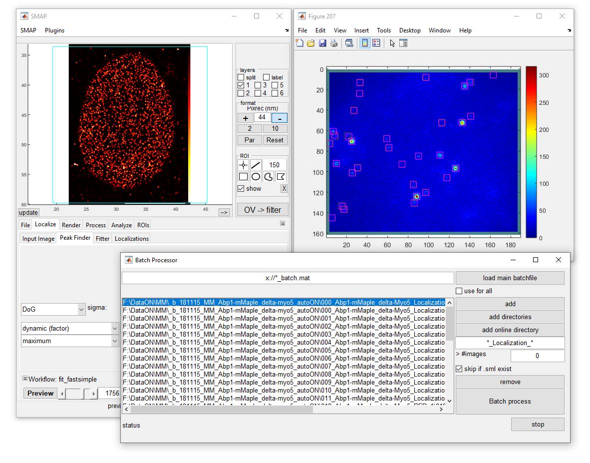

# Analysis software

The Ries group is actively developing algorithms and integrating the state of the art analysis pipelines for localization microscopy into its Matlab platform.

### Superresolution Microscopy Analysis Platform (SMAP)

[SMAP](https://github.com/jries/SMAP) is a large Matlab software allowing fitting, rendering, post-processing and visualization of localization microscopy data. Also available as stand-alone version. It includes (non-exhaustive list):

- Calibration of experimental PSFs (CPU and GPU-accelerated)
- Filtering, rendering, color-coding of localizations
- 3D drift correction, statistical analysis, FRC
- 3D viewers and image export
- Batch fitting of multiple experiments
- Live analysis of ongoing experiments
- Site explorer with annotations

------

### Fit3Dcspline

[Fit3Dcspline](https://github.com/jries/fit3Dcspline) is a GPU-accelerated 3D fitting algorithm using experimental PSF. **Now fully integrated in SMAP, the fit3Dcspline repository will not be updated anymore.**

Li, Y., Mund, M., Hoess, P. *et al.* Real-time 3D single-molecule localization using experimental point spread functions. *Nat Methods* **15,** 367–369 (2018). [DOI](https://doi.org/10.1038/nmeth.4661)

