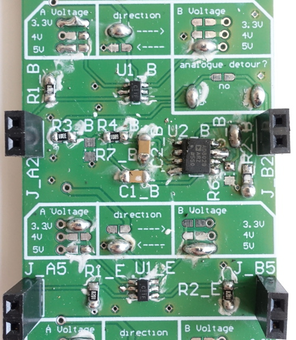

## Bi-directional digital conversion and low-pass filtering

The analog voltage converter board consist of 4 channels performing a voltage conversion from 3.3, 4 or 5 V to 3.3, 4 or 5 V. The conversion direction between input and output voltage can be selected on the board for each channel. Additionally, it features 4 channels capable of the same voltage conversion on top of a low-pass filtering. The latter is used to produce an analog signal from a PWM input. This board is used in conjunction with a FPGA (Alchitry) in the [MicroFPGA](https://github.com/jdeschamps/MicroFPGA) project.

The project contains the following items:

- [Altium project](Altium_project)

- [Bill of materials](BOM)

- [Gerber files](Gerber)

- [Drill instructions](NC_Drill)

- [Circuits PDF](Board_and_circuit.PDF)

  

The board was designed, produced and tested by Christian Kieser (Electronic workshop, EMBL).
