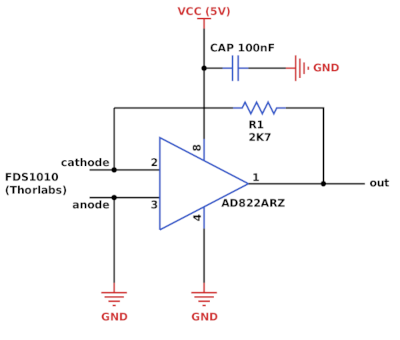

# Powermeter

We integrated a simple powermeter to our microscopes by reflecting the collimated illumination lasers on an optical window and directing the beams towards a photodiode (FDS1010, Thorlabs). Then, a low power FET-input operational amplifier (AD822ARZ, Analog Devices) is used to change the current read-out into a voltage read-out. The output voltage is measured by an FPGA (see [MicroFPGA](https://github.com/jdeschamps/MicroFPGA)) compatible with [Micro-Manager](https://micro-manager.org/) and displayed to the user within [htSMLM](https://github.com/jdeschamps/htSMLM), a reconfigurable user interface. 

Here are approximative steps:

1. Find a reflecting element, such as a glass window, and measure the reflectance (percentage of laser power reflected) for each of the wavelengths used in your microscope. Two parameters can be important in the choice of the reflecting element: flatness (if your imaging requires low aberrations in the illumination path) and reflectance (in case laser intensity is critical).

   For instance, we measured:

   | Wavelength | Reflectance |
   | :--------: | :---------: |
   |   405 nm   |     78%     |
   |   488 nm   |     5%      |
   |   561 nm   |     2%      |
   |   640 nm   |     4%      |

   > **Note**: due to space constraints, this was measured after reflection on two silver mirrors. Thus the numbers are inflated.
   >
   > **Note**: we cannot trace which element we used, but it seems to be fused-silica, 5 mm thick.

2. Mount the reflecting element on a kinematic mount. We glued our using UV-glue on a Throlabs KM100PM/M, after having removed the platform.

3. Reflect the collimated laser on the photodiode. We screwed our photodiode on a [simple 3D printed holder](Photodiode_holder): the holder can be screwed on top of a Thorlabs 1/2" post and, after shaping the holes with a threading tool, three plastic screws hold the photodiode in place.

   > **Note**: the photodiode can heat up and the output voltage will therefore be modified. It is probably better to insure proper passive cooling with an aluminum holder for instance.

4. Measure the current at full power (or typical maximum power used) for all your laser lines. You can also use ND filters to choose your dynamical range. For instance, we placed a 0.3 ND filter in before the photodiode.

5. We use the following circuit to convert current to voltage:

   

   The resistor R1 sets the circuit gain and should be chosen for your own application. Example: if the maximum measured current is 1.7 mA, then given the output voltage we want 5 V, we get R = V/I = 2777 Ohms (Ohm's law). 

   > **Note**: The AD822 has supply capability from 5V to 30V, in case you want a higher output voltage.
   >
   > **Note**: You can used a voltage divider circuit after the current to voltage converter to fit your voltage reading device.

6. Using a high-end powermeter, we measured **repeatedly** the total voltage after the reflecting element (before entering the microscope on the illumination path) and plot power versus voltage output for each laser line. Fit a linear curve to each table: this yields the slopes and offsets necessary to convert the measured voltage to laser power entering the microscope.

7. Finally, we feed the output to the analog converter board provided in the [MicroFPGA](https://github.com/jdeschamps/MicroFPGA) repository. Upon request, the FPGA reads out the voltage and updates it in [Micro-Manager](https://micro-manager.org/). [htSMLM](https://github.com/jdeschamps/htSMLM) allows plotting continuously the laser power in mW using provided wavelengths, slops and offsets.

This powermeter is a simple solution to monitor the laser power in our microscopes. Note that it is approximative and can be temperature-dependent.

The electronic circuit was designed and tested by Vera Stankova (Electronics workshop, EMBL). The 3D printed holder was designed by Ulf Matti.

