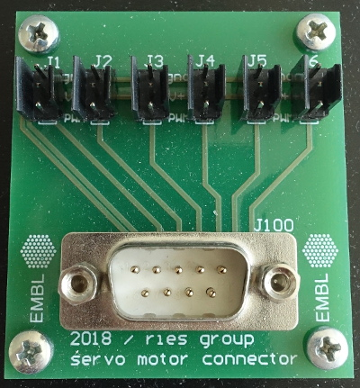

# Servomotor distribution board

The servomotor distribution board is intended to be a hub for servomotor cables. Placed in the center of the microscope, we use it to drive several servomotors (back-focal plane lens, 3D lens, filter wheels...etc..), see [some of the elements presented here](https://github.com/ries-lab/RiesPieces/tree/master/Microscopy). The flat cable from the DSUB9 is connected directly to a FPGA (see the [MicroFPGA](https://github.com/jdeschamps/MicroFPGA) project).

The project contains the following items:

- [Altium project](Altium_project)
- [Gerber files](Gerber)
- [Drill instructions](NC_Drill)

The board was designed by Ulf Matti (Ries lab, EMBL), and produced and tested by Christian Kieser (Electronic workshop, EMBL).