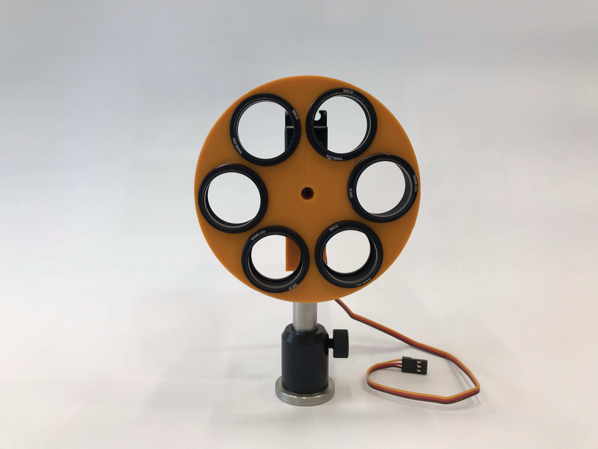

# Filter wheel

In order to change filters automatically during imaging, we often use a 6-filter wheel mounted on a 360 degrees rotation capable servo motor. The filter wheel comes in two flavors: machined or 3D printed.

## Machined filter wheel

The module is composed of the following elements:

- [Machined](Machined_wheel) printed wheel.
- [Machined](Machined_adapter) printed adapter.
- [GWS sail winch servo](https://www.pololu.com/product/522) (GWS S125 1T 2BB), usually available on ebay.
- Post and post-holder from Thorlabs.

The servo is controlled using a typical servo signal (1-2ms) and powered by 5 V.

## 3D printed filter wheel

The module is composed of the following elements:

- [3D](3D_printed_wheel) printed wheel.
- [3D](3D_printed_adapter) printed adapter.
- [GWS sail winch servo](https://www.pololu.com/product/522) (GWS S125 1T 2BB), usually available on ebay.
- [SM1L05](https://www.thorlabs.de/thorproduct.cfm?partnumber=SM1L05) lens tube from Thorlabs x 6
- Post and post-holder from Thorlabs.

Note if scaling is necessary: the wheel diameter is 100 mm and the height of the adapter (largest dimension) is 30 mm.

The servo is controlled using a typical servo signal (1-2ms) and powered by 5 V.