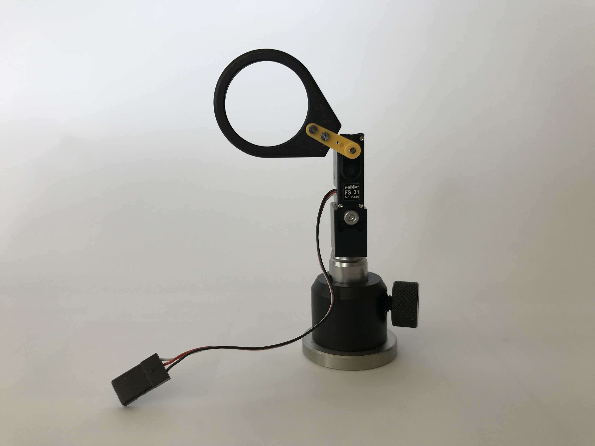

# Flip mount

For non-imaging elements (e.g. beam stop), or elements used for a single snap (such as a Bertrand lens), we often insert the elements in a lens mount operated by a simple servo motor. Remembering two different positions allows placing the element in and out of the beam path.

The module is composed of the following elements:

- [Machined](Machined_adapter) adapter.
- Pico class servo (Robbe FS 31).
- Lens mount 1" from Thorlabs with self-drilled holes.
- Post and post-holder from Thorlabs.

The servo is controlled using a typical servo signal (1-2ms) and powered by 5 V.