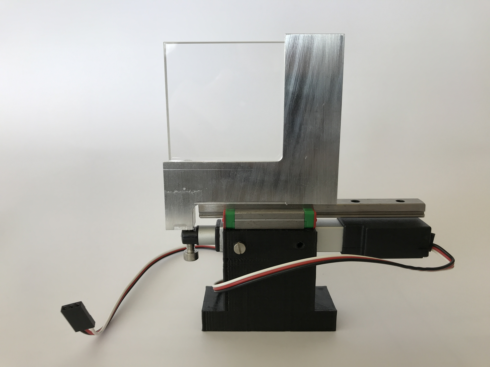

# Linear stage 

To build a linear stage we make use of a linear actuator servo motor fixed on a 3D printed base. The load is mounted on a rail (itself fixed to the 3D printed base) and attached to the servo shaft tip. When actuating the servo, the shaft pushes the load in position. 

For instance, we use this system when placing in or out a 3D lens in our beam path: 

#### Parts

- [3D printed base](3D_printed_base).
- [L12-R linear servos (Actuonix)](https://www.actuonix.com/L12-R-Linear-Servo-For-Radio-Control-p/l12-r.htm)
- MR9 MGN H block rail with length matching the linear servo.
- Load (depends on application).

#### Notes

The rail carriage is fixed from the bottom. The servo is fixed by the pressure between the side walls and between the carriage and the base. Screws can be inserted (see picture above) to increase this pressure.

:warning: careful when removing the rail from the carriage, as the balls might fall. :warning:

This system was designed by Ulf Matti, Ries lab, EMBL.