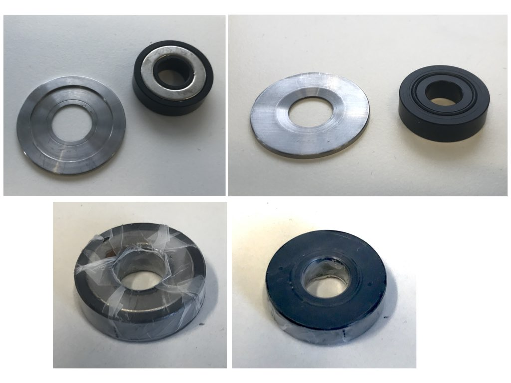

# Magnetic sample mount
Sample holder for round 24 mm coverslips (but easily adaptable for other coverslip sizes). Just put the coverslip on the magnetic base and put the magnet in its holder on top. It seals the sample immediately.

You can cover the magnet holder in para film to avoid contamination of the sample. Just place the parafilm over the underside, push through the center with a pipette tip or pen, and fix the overhanging parts.

You can cover the sample volume wit another coverslip.

#### Parts

- [Magnetic Base machined from magnetic stainless steel](MagneticBase.pdf).
- [Magnet holder machined from hard PVC or similar](MagnetHolder.pdf).
- [Ring magnet 26.75/16x5  N42, e.g. from supermagnete.de  R-27-16-05-N](https://www.supermagnete.de/eng/ring-magnets-neodymium).
- O Ring: 20x1.5, 70NBR33002, Freudenberg #49364018.
