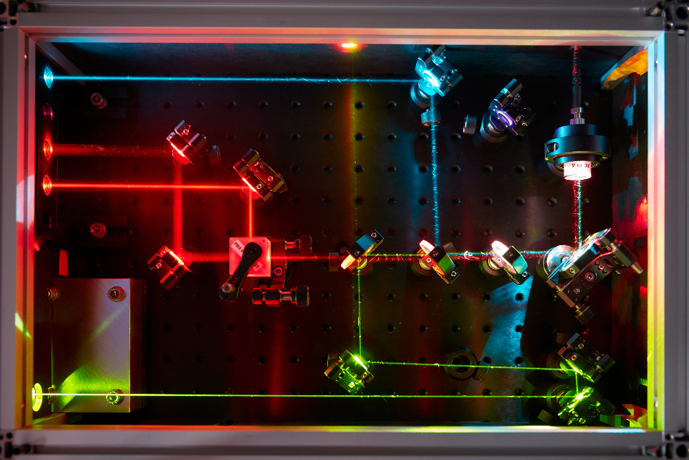
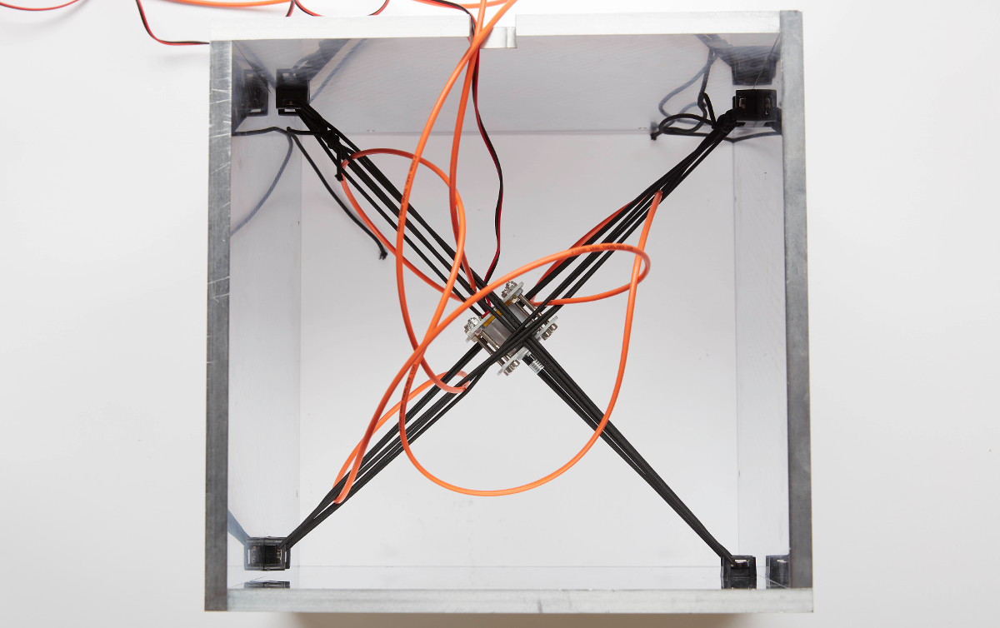

# Microscope illumination

#### Open-source laser engine

We developed an open-source and powerful laser engine at a fraction of the cost of commercial laser combiners. The laser engine includes the optical path, the electronics to drive inexpensive laser diodes and an agitation module. You can find all part lists, blueprints and guidelines on the [laser engine repository](https://github.com/ries-lab/LaserEngine).

D Schroeder\*, J Deschamps\*, A Dasgupta, U Matti and J Ries, "Cost-efficient open source laser engine for microscopy," Biomed. Opt. Express **11**, 609-623 (2020); [DOI](https://doi.org/10.1364/BOE.380815)

#### Speckle-reduction

As part of the laser engine project, we described two different speckle-reduction approaches:

- [Using a commercial oscillating diffuser](https://github.com/ries-lab/LaserEngine/tree/master/Laser_Engine/LSR). 
  J Deschamps, A Rowald, and J Ries, "Efficient homogeneous illumination and optical sectioning for quantitative single-molecule localization microscopy," Opt. Express **24**, 28080-28090 (2016); [DOI](https://doi.org/10.1364/OE.24.028080)

- [By agitating the fiber in an agitation module](https://github.com/ries-lab/LaserEngine/tree/master/Agitation_Module).

Pictures credit: *EMBL/Marietta Schupp*