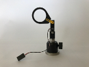
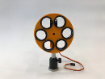
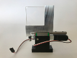

# Microscopy

### Illumination

In the recent years, we developed optical systems that achieve homogeneous illumination of the sample, including an affordable, high-power, laser engine. For more details, [visit the microscope illumination sub-module](Microscope_illumination).

### Focus-lock system

Low axial drift is a critical feature of a microscope, in particular for superresolution methods. In order to compensate for axial drift, we build a [focus-locking system](Focus-locking) similar to the Nikon perfect focus or the open-source [pgFocus](http://big.umassmed.edu/wiki/index.php/PgFocus).

### Movable elements

In order to perform automated imaging, we place optical elements that are frequently exchanged on stages or servos. In order to bring the price down, we often opt for custom solutions based on inexpensive servos. You can find here some of the modules we use on our microscopes.

- [Filter wheel](Filter_wheel) to change filters. 
- [Flip mount](Flip_mount) to insert or remove a filter or a lens. It can also be used as beam stop.
- [Linear stage](Linear_stage) to insert more precisely an optical element, such as a cylindrical lens (3D localization) or multiple filters in a row.

##### Gallery:

Note that these elements are controlled on our microscope using an FPGA (see the electronics section), the project is [hosted on Github](https://github.com/jdeschamps/MicroFPGA).

### A magnetic sample holder for coverslips
[Sample Holder](Magnetic_Sample_Holder) that seals immediately, no breaking of the coverslip.
