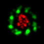

#   Ries pieces

## Recipes for open microscopy

The purpose of the repository is to document small and large internal projects that we hope can benefit other research groups. These projects range from tricks to move elements on the optical table to our complete analysis software. Some projects are hosted on their own repository and are just linked here.

Visit the sub-directories to get more information on their content:

- [Analysis software](Analysis_software)
- [Electronics](Electronics)
- [Microscope control with Micro-Manager](Microscope_control)
- [Microscopy](Microscopy)

  

#### Contact

If you have any question, get in touch with the [Ries group](https://rieslab.de/#contact).

#### License 

[GNU LGPL](license.txt)
